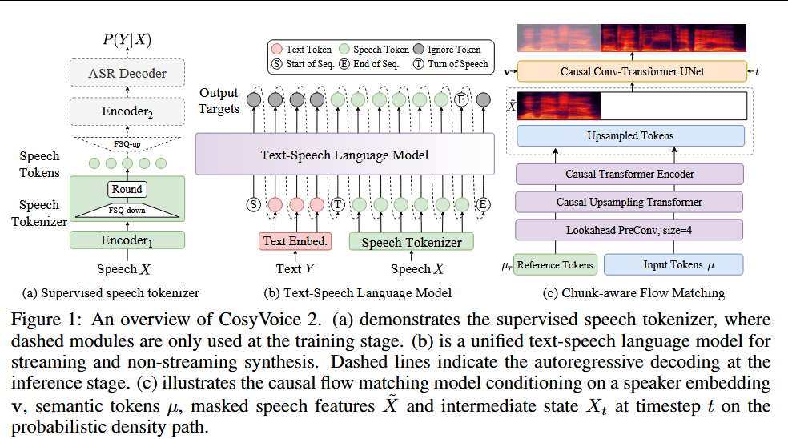
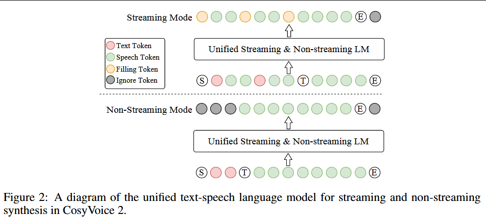

# 2024-CosyVoice 2: Scalable Streaming Speech Synthesis with Large Language Models

***

**简称：** **CosyVoice 2**

**作者：** Zhihao Du; Yuxuan Wang; Qian Chen; Xian Shi; Xiang Lv; Tianyu Zhao; Zhifu Gao; Yexin Yang; Changfeng Gao; Hui Wang; Fan Yu; Huadai Liu; Zhengyan Sheng; Yue Gu; Chong Deng; Wen Wang; Shiliang Zhang; Zhijie Yan; Jingren Zhou

**来源：** arXiv

**DOI：** [10.48550/arXiv.2412.10117](https://doi.org/10.48550/arXiv.2412.10117)

**发表时间：** 2024-12-18

**本地链接：** [2024 - CosyVoice 2 Scalable Streaming Speech Synthesis with Large Language Models.pdf](zotero://open-pdf/0_5EZLUJBC)

**摘要：** *在我们之前的工作中，我们介绍了CosyVoice，一个基于有监督的离散语音令牌的多语言语音合成模型。通过使用两种流行的生成模型语言模型(LMS)和流匹配的渐进式语义解码，CosyVoice在语音上下文学习中表现出高度的韵律自然度、内容一致性和说话人相似性。近年来，多模式大语言模型(LLMS)取得了显著进展，其中语音合成的响应延迟和实时因素在交互体验中起着至关重要的作用。因此，在这份报告中，我们提出了一种改进的流语音合成模型CosyVoice 2，该模型结合了全面和系统的优化。具体地说，我们引入了有限标量量化来提高语音令牌的码本利用率。对于文本-语音LM，我们简化了模型体系结构，以允许直接使用预先训练的LLM作为主干。此外，我们开发了一个块感知的因果流匹配模型来支持不同的合成场景，支持在单一模型中进行流合成和非流合成。通过在大规模多语言数据集上进行训练，CosyVoice 2在流模式下实现了与人类相当的自然度、最小的响应延迟和几乎无损的合成质量。我们邀请读者在https\://funaudiollm.github.io/cosyvoice2.上收听演示*

**评价：**

***

## 💡贡献：

\#阿里巴巴 #代码开源 #模型开源

1.  提出有限标量量化技术来提高语音token的codebook利用率（与SimpleSpeech思路一致）
2.  精简text-speech LM结构，从而可以直接使用预训练好的LLMs作为Backbone
3.  设计了基于chunk的因果流匹配模型，从而使一个模型可以兼容流式和非流式两种合成方式，适配不同应用场景

<!---->

1.  将流式和非流式合成统一在一个框架中，并提出统一的文本语音语言模型和块感知因果流匹配模型，与离线模式相比，实现了无损流式合成。
2.  通过移除文本编码器和说话人嵌入来简化 LM 架构，允许预先训练的文本大型语言模型 （LLM） 作为支柱，从而增强上下文理解。
3.  将语音分词器中的矢量量化 （VQ） 替换为有限标量量化 （FSQ），提高码簿利用率并捕获更多语音信息
4.  升级 instructed TTS 容量以支持更多指令，包括情感、口音、角色样式和细粒度控制。在 CosyVoice 2 中，instruction和zero-shot能力集成到一个模型中，实现更通用、更生动的合成。

## 🌏背景：

基于深度学习的TTS合成效果远超传统的基于拼接方法和统计参数方法，其可以针对预定的发音人合成高质量的自然语音。近期工作展示了从参考音频中学习音色、风格、韵律从而合成任意发音人语音的能力。基于in-context learning，zero-shot TTS在大规模数据集上进行训练，可以达到媲美真人的合成效果。

Zero-shot TTS可以分为三类：

1.  Codec language model编解码器语言模型利用语音编解码提取离散语音表征，如SoundStream，再使用自回归模型如VALL-E2或masked 语言模型来预测语音token，使用解码器将token解码得到语音信号。同时也有使用连续语音表征作为token的。基于语言模型的TTS系统可以通过自回归采样获得多样的、韵律一致的语音。

2.  feature diffusion model受图像生成领域的启发，去噪扩散模型和流匹配模型被用于非自回归形式的语音合成。早期扩散模型余姚音素级时长以解决文本-语音不等长的问题，但是这种硬对齐会损伤语音的自然度，导致过于平淡的韵律。为解决这一问题，引入了cross-attention和Diffusion Transformers。最新的TTS大模型如E2TTS、SeedTTS等，直接再输入上使用特殊标记填充至匹配输出长度，输出长度使用单独的句级时长预测模型预测或人为给定。由于NAR TTS模型不受限与编解码器的解码器，因此可以获得更改的音质。【存疑，别的论文都是说AR音质更好，而且NAR即便不适用Codec，也需要vocoder】

3.  混合模型：text-to-codec language model & codec-to-feature diffusion model使用AR语言模型建模文本和语音的对齐问题，使用扩散模型从codec中生成语音特征（如Mel）。作者认为这种方式兼具两者的优点。

上述三类方法都是非流式的，因此要求输入全部文本，且时延很大。虽然有一些将语言模型适配流式合成的工作，但是扩散模型和混合模型仍然缺少完善的解决方案。

## 🧩模型：

high-level text tokens -> Text-speech language model -> semantic speech tokens -> Flow Matching Models -> acoustic details -> mel -> Vocoder -> wav

1.  Text Tokenizer

    1.  使用原始文本输入，通过BPE编码（Bert中的word peice）而不是使用G2P。作者指出，这种方式不仅简化了数据处理流程，还可以让模型端到端的学习发音信息。

    2.  不同于LLM中使用tokenizer，本文将1对多tokens进行了mask，这可以防止token的发音变得过长，并减少由数据稀疏引起的极端情况

        1.  就是中文不适用BPE，直接使用单个字符

2.  有监督的Semantic Speech Tokenizer - 不同于Codec，其训练任务为ASR而不是音频重建，从而是Semantic Token而不是Acoustic Token

    1.  在SenseVoice Large ASR模型的Encoder中插入FSQ模块。

    2.  FSQ：先降维，然后量化，然后再升维，比SimpleSpeech的复杂一点

        1.  升维只是用于后续ASR，不用于特征提取

    3.  25Hz，即1s语音输出25帧特征

3.  统一的Text-Speech Language Model - 所以Qwen直接接受文本输入，输出speech token？

    1.  使用与训练的Qwen2.5-0.5B模型作为LM，使用输入文本作为promt，自回归的生成语音token

    2.  相比与CosyVoice1，移除了speaker embedding，以防止信息泄露。作者发现，句子级的特征向量不仅包含身份信息，还包含语言和副语言信息，会影响合成韵律的自然度以及跨语种合成能力。

    3.  相比与CosyVoice1，还移除了Text Encoder模块，因为Qwen2.5-0.5B有足够的能力学习到文本和语音对齐信息。

    4.  自回归及非自回归方式：

        1.  
        2.  非自回归时将输入直接concat，自回归时，按比例先后放置text token 和speech token，text放完之后放入标志位再放入全部音频
        3.  训练时，将两种序列都输入，从而一个模型可以完成这两个任务。

4.  基于块的流匹配

    1.  使用mel谱，50Hz，对speech token进行上采样，上采样之前使用look-ahead layer来获取未来的信息
    2.  然后使用chunk-aware causal transformer block将上采样后的特征匹配到mel谱
    3.  使用条件流匹配，使用speech tokens、参考音频和说话人embedding作为条件   --masked mel spectrogram，基于mask\&predict策略，而不是降噪策略
    4.  训练时，流步数采用标准分布，推理时，采用余弦分布以再开始生成阶段分配更多的步数
    5.  CFG
    6.  四种mask同步训练，一方面减轻了部署复杂度，另一方面具有更多信息的mask策略可以作为tearcher模型指导具有更少信息的mask策略，从而隐式的进行自蒸馏学习。

5.  流式模型的时延分析

    1.  LLM的tokens肯定比CosyVoice2的tokens的长，因为multi-cahracter mask --没搞懂，不应该时CosyVoice2的更长吗

6.  Instructed Generation

    1.  引入了结构化数据1500h

7.  multi speaker fine tuning

    1.  使用多个说话人一起fine tuning，从而覆盖更多样的韵律和发音，同时避免灾难性遗忘
    2.  方式为添加单独的speaker promt；未知发音人的添加unknown promt

8.  强化学习

    1.  使得模型输出与人类偏好进行对齐，使用了Speaker Similarity和 WER，基于这两个指标区分接受样本和拒绝样本，然后基于direct preference optimization（#todo ）进行训练；但是这种方式，一次训练步需要四次前向过程
    2.  为了减少计算复杂度，直接将生成semantic token映射到量化后的低秩特征表示，然后使用ASR的encoder2+decoder预测输入序列，将log PPG作为语言模型的强化学习奖励。

## 🔬实验：

1.  训练数据：

    1.  for speech tokenizer：11万小时中文+9万小时英文；实验证明模型可泛化到其他语种

    2.  for CosyVoice2：13万中文+3万英文+4600日文+2200韩文

        1.  使用Paraformer（中文）和SenseVoice（其他）为音频生成文本标签
        2.  使用强制对齐工具过滤低质量的数据

2.  测试数据：

    1.  Librispeech test\_clean：使用whisper-large v3计算wer，使用ERes2Net提取说话人embedding计算余弦相似度作为SS
    2.  Seed test sets：使用Paraformer 计算中文wer，whisper-large v3计算英文wer，使用WavLM-SV 和ERes2Net两个模型计算余弦相似度
    3.  test-ja & test-ko

3.  Speech Tokenizer 实验结果

    1.  理想的speech tokenizer应该能够有效地利用码本，以高保真度保存信息，并证明说话人的独立性。

    2.  码本利用率：与VQ仅23%的利用率相比，FSQ利用率为100%

    3.  ASR Error Rate：与VQ相比，FSQ错误率明显更低，说明FSQ保留了更多的语义信息

    4.  说话人独立性：

        1.  t-SNE可视化，量化前不同说话人的特征呈现出不同的分布趋势，而量化后的特征趋同，证明量化移除了音色信息
        2.  基于S3prl toolkit，使用Sensevoice-large encoder + FSQ 提取特征训练说话人识别任务，量化前的模型可以正常收敛，而量化后模型无法收敛，进一步说明了量化后特征不包含音色信息

4.  CosyVoice2

    1.  与ChatTTS、GPT-SoVITs、OpenVoice、ParlerTTS、EmotiVoice在libtispeech test clean 上进行测试，WER、NMOS、SS全面领先，甚至超越真人水平。

    2.  在SeedTTS test-zh测试集上，CER和SS都领先于开源模型，低于SeedTTS；注意到该表中MaskGCT CER表现较差，而SS表现很好，E2TTSCER还可以，但SS稍差

    3.  在SeedTTS test\_en测试机上，WER和SS表现都一般，作者认为可能是由于训练数据不均衡，英文数据较少；

        1.  MaskGCT使用中英各五万数据，达到了相近的WER个较高的SS，说明并不是因为英文数据量少

    4.  在SeedTTS test-hard测试集上，CosyVoice2取得了最低的WER，和较高的SS

    5.  整体来看，CosyVoice2与F5-TTS效果相当，并没有展现出绝对的领先

    6.  流式模型整体来看效果与非流式模型相当，证明了统一范式框架的有效性

    7.  作者还发现不同SV模型评测出的SS排名不一致，并指出如何自动评价相似性可以作为后续研究工作

5.  消融实验

    1.  引入预训练LLM显著提升了中文测试集上的CER和SS

    2.  移除speaker embedding，显著降低了WER，SS没有明显变化，表明内容信息主要由LM建模，而说话人信息主要由流匹配模型恢复。

    3.  使用FSQ替换VQ，大幅提升了WER， SS没有明显变化

    4.  在训练FSQ时引入pitch loss 可以进一步降低WER，作者计划后续进行深入研究

    5.  流式：

        1.  LM流式在中英文测试集上，几乎没有损失，在hard集上CER有明显性能下降
        2.  FM流式反而微弱提升了SS，作者认为，这可能是因为在流式合成中，起始块内的promt比例较高，而非流式时由于padding的原因导致promt比例较低；同时FM流式对CER影响相对较小，这是因为语义信息都在LM中建模好了

6.  在日语和韩语上的表现较差

7.  Instructed Generation

    1.  <a href="zotero://open/library/items/5EZLUJBC?page=13">“When input instructions are removed from CosyVoice 2, there is a notable decline in MOS-I; however, improvements are observed in content consistency (CER), speaker similarity (SS), and speech quality (NMOS). This indicates that instruction controllability is difficult to implicitly emerge from content text.”</a>(<a href="zotero://select/library/items/ZLTQK6FK">Du 等, 2024, p. 13</a>)

8.  multi spekaer fine-tune

    1.  从400个参考音频中提取speaker embedding，然后进行聚类，从而获得稳定的音色特征
    2.  不同发音人在wer和SS上的表现基本一致
    3.  说明大多数发音人可以继承zero-shot tts模型的上下文理解和感知能力，从而自然地表达各种情绪和情感

9.  强化学习微调LM

    1.  并没有取得什么实际提升和改善

## 📜结论：

## 🚩不足：

1.  仅支持四种语言
2.  不支持通过文本promt控制声音特性
3.  不支持歌声合成

## ❓问题：
