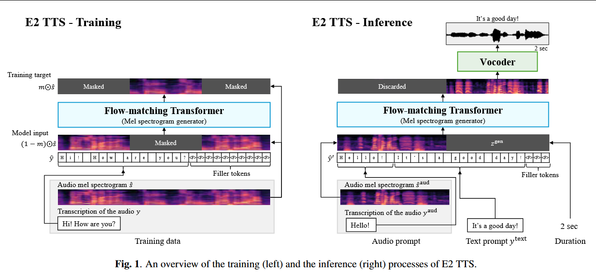

# 2024-E2 TTS: Embarrassingly Easy Fully Non-Autoregressive Zero-Shot TTS

***

**简称：** **E2 TTS**

**作者：** Sefik Emre Eskimez; Xiaofei Wang; Manthan Thakker; Canrun Li; Chung-Hsien Tsai; Zhen Xiao; Hemin Yang; Zirun Zhu; Min Tang; Xu Tan; Yanqing Liu; Sheng Zhao; Naoyuki Kanda

**来源：** arXiv

**DOI：** [10.48550/arXiv.2406.18009](https://doi.org/10.48550/arXiv.2406.18009)

**发表时间：** 2024-09-12

**本地链接：** [2024 - E2 TTS Embarrassingly Easy Fully Non-Autoregressive Zero-Shot TTS - Eskimez 等.pdf](zotero://open-pdf/0_2T4JIK9V)

**摘要：** *本文介绍了非常简单的文本转语音（E2 TTC），这是一个完全非自回归零样本文本转语音系统，提供人类水平的自然性以及最先进的说话者相似性和可理解性。在E2 TTC框架中，文本输入被转换为具有填充标记的字符序列。然后根据音频填充任务训练基于流匹配的梅尔谱图生成器。与许多以前的作品不同，它不需要额外的组件（例如，时长模型、字形到音素）或复杂技术（例如，单调对齐搜索）。尽管它很简单，但E2 TTC实现了最先进的零样本TTS功能，与之前的作品（包括Voicebox和NaturalSpeech 3）相当或超过。E2 TTC的简单性还允许输入表示的灵活性。我们提出了E2 TTC的几种变体来提高推理过程中的可用性。请访问https\://aka.ms/e2tts/了解演示示例。*

**评价：不亏是微软出品，效果确实好。而且还支持口语不连贯现象。小瑕疵是，不同情感下的口语不连贯现象是不一致的，比如愤怒等比较激动的场景下不连贯反而很少，多了显得不够自然。**

***

## 💡贡献：

  #微软 #谭旭 #SOTA #LLM

本文提出了E2 TTS，一种基于非常简单模型结构实现的全非自回归零样本TTS系统。仅包括两个模块，基于流匹配模型的Mel谱生成模块和声码器模块。原始文本输入先转换为字符序列，并进行填充以匹配mel谱长度。Mel谱生成模块由Transmer + U-Net skip connection构成，基于语音填充任务进行训练。

尽管E2TTS结构非常简单，其可以获得与Voicebox和NS3相当的效果。同时E2TTS的简单性还允许了输入的多样性。

## 🌏背景：

近年来语音合成系统已经能够合成与真人相当的语音，因此研究重点转向zero-shortTTS。

早期的工作多使用speaker embedding作为额外条件，VALL-E将该问题重构为编解码器领域中的语言建模问题，在不失简单性的网络结构中即可实现相似度的大幅提升。启发了很多后续工作，VALL-E 2通过repetition-aware sampling and grouped code modeling 方法实现了人类水平的zero-shot TTS。

这种codec language model based TTS，受限于自回归结构，存在以下局限性：

1.  codec token需要顺序采样，必然导致推理时延
2.  需要精心设计的tokenizer以获取text token和audio token
3.  需要添加额外的技巧来保持长序列场景下的稳定性，如自回归结合非自会、多尺度transformer、grouped code modeling

还有一些非自回归方法。包括NS2和NS3基于扩散模型估计codec的隐藏特征，Voicebox 和Match-TTS基于流匹配模型。但是非自回归方法最大的问题是如何获取文本和音频之间的对齐关系。NS2、NS3、Voicebo使用帧级别的音素时长信息来训练模型，Matcha-TTS使用MAS进行对齐。尽管MAS不需要帧级别的音素对齐，但是在推理时仍然需要一个单独的时长预测模型预测音素级别的时长。E3TTS使用U-Net结构+cross-attention结构。本文发现这些显式时长预测或精心设计的结构并不是必须的，甚至会影响合成音频的自然度。

TTS系统面临的另一个问题是如何选择text tokenizer。

与本文同时进行的工作还有SeedTTS，但是作者说SeedTTS论文的细节不够丰富，因此无法进行比较。

## 🧩模型：

*   流程图

    1.  训练阶段：mask-and-predict 策略

        1.  使用filler token padding在字符序列的尾部，使其长度与mel谱相同

    2.  推理阶段：

        1.  将promt text 和target text 拼接，再padding filler token至指定长度；promt mel也padding 0 到指定长度
        2.  duration 哪来的？

*   Flow-matching-based mel spectrogram generator #todo 待补充完善

    1.  conditional flow-matching

    2.  model architecture 与Voicebox一样，只是改变了输入

        1.  这个改变简化了模型，不再需要G2P模块、音素对齐模块和音素时长预测模块。
        2.  换言之，这里的mel generator相当于Voicebox的G2P+时长预测模块+声学模块
        3.  联合建模再保持原有音色相似度和可懂度的前提下，显著提升了自然度

*   模型变种

    1.  X1: 不使用参考音频的文本作为promt - 训练阶段仅输入masked音频对应的文本，推理阶段仅输入待合成文本

        1.  推理阶段简单替换即可
        2.  训练阶段获取masked region对应的文本，一种方法是对masked region直接使用ASR，直观但消耗较大。本文中还是使用MFA来获取单词的起止时间。在添加mask时候需要注意不能从单词中间切开。

    2.  X2: 支持显示音素输入指定发音

        1.  作者提出的应用场景是，为外国人名指定发音
        2.  训练时候随机使用括号包括起来的音素序列代替一个单词。使用CMU dict，以15%的概率进行替换。在推理时候即可支持用括号包括起来的音素。
        3.  输入序列仍然是简单的字符串，它代表单词还是音素仅由其内容和是否被括号括起来决定。
        4.  注意在音素替换时，需要保留原来的标点符号。

## 🔬实验：

1.  训练数据：

    1.  Libriheavy dataset， 50k h for 6k id，全英文，具有保留大小写和标点符号的抄写。
    2.  自有200k 小时数据验证data scale的影响

2.  测试数据：

    1.  LibriSpeech-PC dataset，同样包含大小写和标点符号

        1.  仅保留4\~10s的数据，共1132条，来自39id
        2.  参考音频为针对随机选取该发音人的一条录音，截取最后3s

3.  模型细节：

    1.  Transformer + Unet connection. 24 layers, 16 attention heads, 1024 embedding dims, 4096 linear dims, 399 embeddings -> 335M params.
    2.  24K sampling rate, 256 hop size, 100 dims
    3.  BigVGAN-based vocoder
    4.  训练阶段mask比例在0.7\~1
    5.  20%概率随机丢弃条件输入以应用**classifier-free guidance**
    6.  所有模型都训练80万步，batch size 307,200帧
    7.  linear decay learning rate, peak\@7.5x10^-5, warmup 2万步
    8.  丢弃少于4000帧的数据（42秒）

4.  预训练模型：

    1.  参考 An investigation of noise robustness for flow-matching-based zero-shot TTS 进行无监督预训练，然后使用预训练的模型进行初始化
    2.  在200kh数据上训练80万步

5.  时长模型：

    1.  借鉴Voicebox，基于transformer结构，8 layer， 8 heads，512 embedding dimension and 2048 linear dimension
    2.  batch size 120,000 frames 训练75k 步

6.  评价指标

    1.  WER：Hubert-large-based ASR
    2.  SIM-OWavLM-large-based spearker verification model
    3.  CMOS
    4.  SMOS

## 📜结论：

1.  在使用相同数据集进行训练时，E2 TTS WER和SIM-O略微优于Voicebox，但CMOS显著优于Voicebox，说明音素级对齐确实限制了模型的自然度。同时作者指出，基于预训练初始化的E2 TTS， CMOS-0.05实际上已经与GT难以区分。

2.  使用大规模数据训练时，即便不经过预训练，E2TTS也可以得到较好的结果

3.  尽管结构简单，但是其效果仍超出了所有baseline

4.  所有baseline和E2 TTS在SMOS上都远超GT，作者认为这是因为原始数据集中，发音人存在模仿角色发音的现象。而在模型之间的比较上，E2 TTS不如NS3和Voicebox

5.  X1在WER和SIM-O上基本与基础模型表现相当，由于其不需要参考音频的转录文本，因此适用性更广。

6.  X2： 测试推理阶段使用不同占比的音素替代

    1.  在不使用音素替代时，X2表现与基础模型相当，说明X2是无损的
    2.  即便使用50%音素替代时，X2的WER也只有较小的恶化，说明X2是有效的

7.  消融实验

    1.  对比Voicebox 和 E2 TTS的训练过程中评价指标曲线，Voicebox 迅速收敛，而E2 TTS收敛较慢但最终收敛效果更好。作者猜测，Voicebox迅速收敛是因为其使用了帧级别的音素对齐，而E2 TTS则在训练过程中逐步学到了更优的G2P mapping。
    2.  对比不同promt length，随着promt变长，SIM-O也相应增加，不过WER没有呈现处明显的相关性。
    3.  对比不同语速，不同语速下WER的变化与MaskGCT基本一致，但整体更低一些。SIM-O在低语速下损失不明显，而在高语速下损失明显。

## 🚩不足：

## ❓问题：

1.  使用character作为输入，英文含标点和ARPABET音素一共399个token，如果应用到中文，常用汉字3500，加上偏僻汉字高达数万个token，显然是行不通的。而且英文属于表音文字，从character映射读音相对容易，但中文属于表意文字，字形和读音难以映射。

    1.  中文是否可以先使用G2P转换为拼音，再作为拼音序列输入？
    2.  那么如何区分是中文序列还是英文序列呢？

2.  本文使用括号括起音素，训练数据中是否存在其他括号，但不是音素的场景？

3.  本文弱化了时长预测器的存在，但与MaskGCT一样，在推理阶段都依赖音素级时长预测以获取目标时长。
