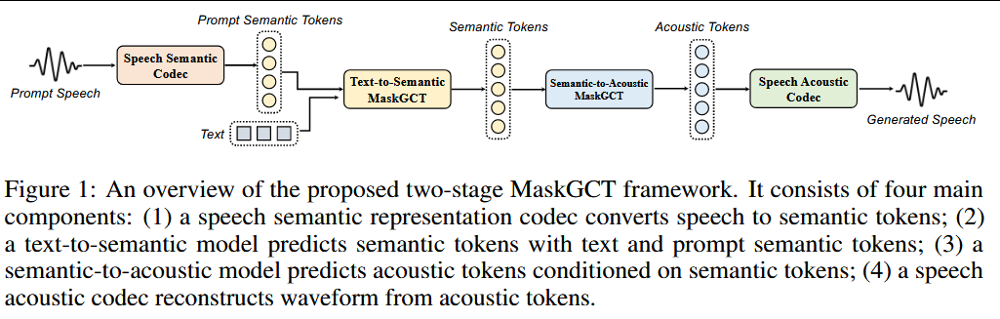
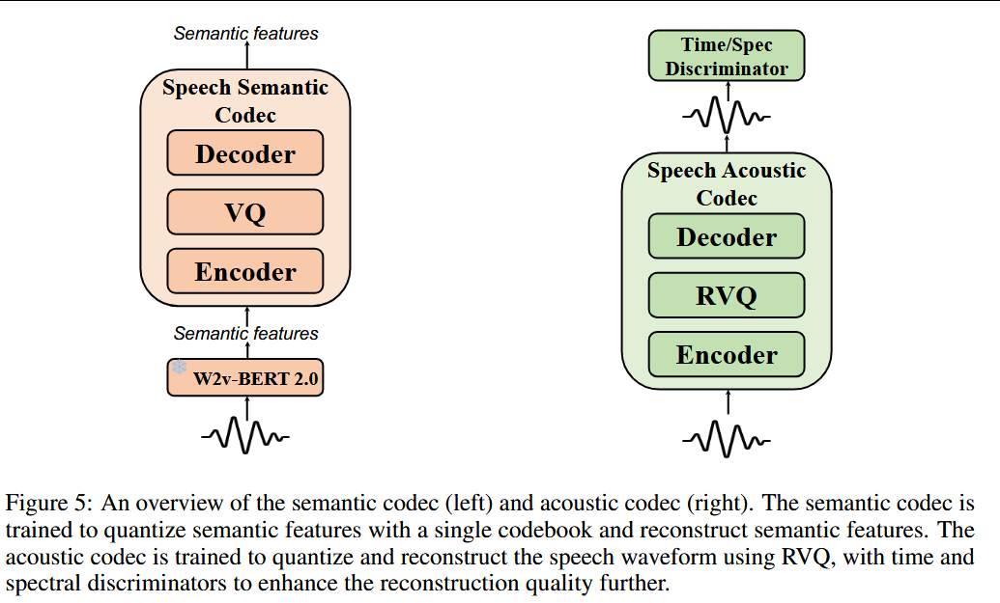
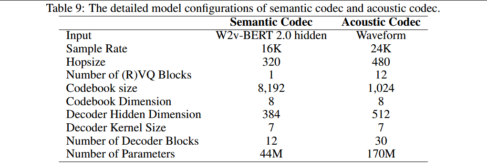
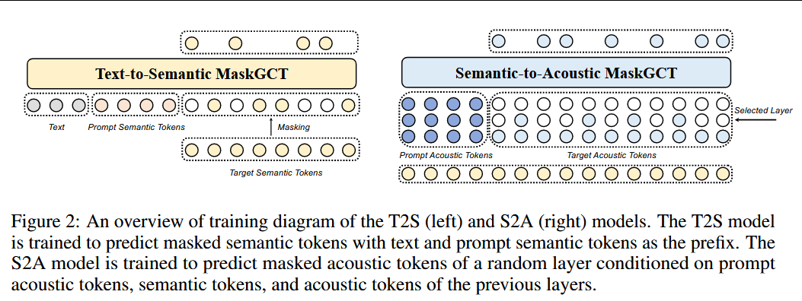

# 2024-MaskGCT: Zero-Shot Text-to-Speech with Masked Generative Codec Transformer

***

**简称：** **MaskGCT**

**作者：** Yuancheng Wang, Haoyue Zhan, Liwei Liu, Ruihong Zeng, Haotian Guo, Jiachen Zheng, Qiang Zhang, Xueyao Zhang, Shunsi Zhang, Zhizheng Wu

**来源：** arXiv

**DOI：** [10.48550/arXiv.2409.00750](https://doi.org/10.48550/arXiv.2409.00750)

**发表时间：** 2024-10-20

**本地链接：** [2024 - MaskGCT Zero-Shot Text-to-Speech with Masked Generative Codec Transformer - Wang 等.pdf](zotero://open-pdf/0_TNKXNVAQ)

**摘要：**

*目前的大规模文语转换系统通常分为自回归系统和非自回归系统。自回归系统隐含地对持续时间进行建模，但在稳健性和持续时间可控性方面存在一定的不足。非自回归系统在训练过程中需要文本和语音之间的显式对齐信息，并预测语言单位(例如音素)的持续时间，这可能会损害它们的自然性。*

*在本文中，我们介绍了一种完全非自回归的TTS模型MaskGCT，它不需要文本和语音监督之间的显式对齐信息，也不需要语音级别的时长预测。MaskGCT是一个两阶段模型：在第一阶段，该模型使用文本来预测从语音自监督学习模型中提取的语义标记；在第二阶段，该模型基于这些语义标记来预测声学标记。*

*MaskGCT遵循掩蔽和预测学习范式。在训练过程中，MaskGCT学习根据给定的条件和提示预测被屏蔽的语义或声学标记。在推理过程中，该模型以并行方式生成指定长度的令牌。*

*用100K小时的野外语音进行的实验表明，MaskGCT在质量、相似性和可理解性方面都优于目前最先进的零镜头TTS系统。音频样本可在https\://maskgct.github.io/.上获得我们在https\://github.com/open-mmlab/Amphion/blob/main/models/tts/maskgct.发布我们的代码和模型检查点*

**评价：** 流程过于复杂

***

## 💡贡献：

  #代码开源 #模型开源 #SOTA #LLM #港中文 #武执政 #Amphion

1.  提出了一种非自回归零样本TTS系统，基于masked generative transformers
2.  在speech SSL模型提取的语音表征训练VQ-VAE提取离散语音语义表征
3.  使用100k小时数据进行训练，达到真人水平的相似度、自然度、可懂度，并具备高灵活性、多样性和可控性
4.  在跨语种培养、声音转换、情感控制、语音内容编辑等方面测试了模型的能力，证明了模型作为语音模型通用基座的能力

## 🌏背景：

随着模型参数量和数据量的增加，大规模TTS系统取得了巨大进展，但是仍然没有脱离小模型时代的自回归、非自回归两大范式，从而小模型时代具有的局限，现在仍未得到解决。具体而言，自回归范式将语音量化为离散token，然后使用decoder-only模型自回归的生成这些token，具有丰富的韵律多样性，但是缺乏鲁棒性，且推理速度较慢。非自回归模型，包括扩散模型、流匹配、GAN等，训练时需要显式的对齐监督信息，同时生成语音较为平淡，欠缺多样性。

最近，<a href="zotero://open/library/items/TNKXNVAQ?page=1">“masked generative transformers”</a> (<a href="zotero://select/library/items/F5BS44LR">Wang 等, 2024, p. 1</a>) 在图像、视频、音频生成领域都得到了广泛应用，并表现出与自回归模型或扩散模型相当的潜力。masked generative transformers 在训练阶段采用<a href="zotero://open/library/items/TNKXNVAQ?page=1">“mask-and-predict”</a> (<a href="zotero://select/library/items/F5BS44LR">Wang 等, 2024, p. 1</a>)训练策略，在推理阶段使用<a href="zotero://open/library/items/TNKXNVAQ?page=1">“iterative parallel decoding”</a> (<a href="zotero://select/library/items/F5BS44LR">Wang 等, 2024, p. 1</a>) 策略。

<a href="zotero://open/library/items/TNKXNVAQ?page=2">“SoundStorm”</a> (<a href="zotero://select/library/items/F5BS44LR">Wang 等, 2024, p. 2</a>) 第一次将masked generative transformers应用到TTS领域，使用语音中提取的语义token作为条件，预测SoundStream（**SoundStream: An End-to-End Neural Audio Codec**）输出的多层声学token。其语义token来源于前置的AR模型，因此SoundStorm更像是一个单纯的声学模型【以前的声学模型直接接受音素输入，这个还需要前置一个音素转语义的模型】，本文作者认为没有充分发挥生成模型的能力。

<a href="zotero://open/library/items/TNKXNVAQ?page=2">“NaturalSpeech 3”</a> (<a href="zotero://select/library/items/F5BS44LR">Wang 等, 2024, p. 2</a>)将语音解耦为代表不同含义的离散token，然后单独生成这些token。依赖于音频-文本对齐监督信息和音素级时长预测。

本文提出了MaskGCT，全自回归TTS模型，不需要音频-文本对齐监督信息。模型分为两个阶段：

1.  T2S，使用参考语音语义token作为promt，根据文本token输入生成语义token输出，使用in-context learning策略进行训练。
2.  S2A，使用参考语音声学token作为promt，根据语义token输入生成声学token输出，声学token来自于RVQ-based speech codec

【显然这个模型相当于以前的声学模型，后面还需要一个vocoder将声学token转为语音信号，不过token来自于codec，因此应该还使用对应codec进行解码】

对于语义token的提取，本问还单独训练了一个VQ-VAE模型以量化SSL提取的embedding，而不是采用传统的kmeans方法。从而减小量化信息损失。

此外，作者还在语音翻译、语音内容编辑、音色转换、情感控制等方面进行了实验，展现了MaskGCT作为语音基础模型的潜力。

<a href="zotero://open/library/items/TNKXNVAQ?page=2">“In summary, we propose a non-autoregressive zero-shot TTS system based on masked generative transformers and introduce a speech discrete semantic representation by training a VQ-VAE on speech self-supervised representations. Our system achieves human-level similarity, naturalness, and intelligibility by scaling data to 100K hours of in-the-wild speech, while also demonstrating high flexibility, diversity, and controllability. We investigate the scalability of our system across various tasks, including cross-lingual dubbing, voice conversion, emotion control, and speech content editing, utilizing zero-shot learning or post-training methods. This showcases the potential of our system as a foundational model for speech generation.”</a> (<a href="zotero://select/library/items/F5BS44LR">Wang 等, 2024, p. 2</a>)

相关工作介绍：

1.  Large-scale TTS传统TTS模型使用高质量的训练数据来获得支持一个或多个发音人的模型。而Large scale模型更关注于zero-shot TTS，即使用目标语音作为promt，无需训练直接合成未见过发音人的音色。如前面介绍，Large scale TTS同小模型架构类似，分为两类：

    1.  AR-based：

        1.  SpearTTS：使用三个自回归模块，分别为文本转语义token，语义转粗粒度声学token、粗粒度转细粒度声学token

        2.  VALL-E：使用AR模型预测EnCodec的首层特征，使用非自回归模型预测EnCodec的最后一层特征。【描述的不太清楚，后续根据原始论文补充】

        3.  VoiceCraft： 使用单个自回归模型预测多层的声学token

        4.  BASETTS：预测从WavLM特征提取的speech codes，然后使用GAN来进行音频信号重建【前面的每一个模型都没有提及音频重建】

    2.  NAR-based：

        1.  NaturalSpeech 2：使用扩散模型预测codec模型提取的特征
        2.  VoiceBox：使用流匹配模型和in-context learning 直接预测mel谱
        3.  MegaTTS：使用自回归模型预测音素级韵律编码，然后基于GAN模型预测mel谱
        4.  MaturalSpeech3：使用离散扩散模型的统一框架，预测解耦语音属性的离散表征

        上述模型都依赖显示的语音-文本对齐信息监督，还有一些NAR-based方法不依赖对齐信息：

        1.  SimpleSpeech：基于扩散模型在连续空间对语音表征进行建模；基于finite scalar quantization(FSQ) 建模；特征直接通过SQ-Codec的decoder解码得到音频输出

            1.  模型可以仅基于语音数据训练

            2.  接受文本输入，直接输出语音信号

            3.  训练了一个Scalar Quantization Codec模型，可以将复杂的语音信号映射到有限、紧凑的隐藏特征空间，从而减轻了扩散模型的建模难度。

            4.  Scalar Quantization：将连续特征扩大指定倍数，再取整，然后再缩小指定倍数得到新的特征

                1.  由于新特征都是整数除固定倍数得到的，因此可认为是一个有限集合（基于原始特征范围有限的前提假设）

            5.  基于LLM + in-context learning预测句子级时长

        2.  DiTTo-TTS：基于扩散模型在连续空间对语音表征进行建模；基于residual vector quantization(RVQ) 建模

            1.  使用现成的text、speech encoder
            2.  Latent Diffusion Model Backbone：基于mask-and-predict策略在单纯语音上训练，使用cross attention引入text encoder提取的文本特征
            3.  使用因果Transformer预测全句时长，训练阶段输出语音特征，使用当前帧对应的剩余帧数作为标签；
            4.  使用预训练的语言模型微调neural audio codec，使用Mel-VAE

        3.  E2 TTS：基于扩散模型在连续空间对语音表征进行建模；基于流匹配直接建模mel谱

            1.  字符串输入、mel谱输出， + vocoder

            【本文主要对比了前面的四个AR和四个NAR的结果，并没有与最新的三个不依赖对齐信息的NAR方法在效果上进行比较，因此这三篇文章仍然值得一读，尤其是港中文和微软的两篇。】

2.  Masked Generative Model

    1.  在图像及视频领域的应用：MaskGIT，MaskGIT-v2，Muse

    2.  在语音生成领域的应用：

        1.  SoundStorm：从AudioLM中提取语音特征，生成SoundStream提取的声学特征
        2.  VampNet、MAGNet应用到音乐及音频生成，MaskSR应用于语音重建

3.  Discrete Speech Representation

    1.  语音表征是语音生成的一个重要方面。早期较多使用Mel谱作为语音表征，现在似乎更流行使用Audio codec提取的离散特征作为语音表征。

    2.  本文把语义特征和声学特征都认为是语音表征。

    3.  语义特征通常由speech SSL提取，再通过k-means聚类得到。speech SSL的训练类似于mask-and-predict，对输入的一部分进行掩盖，然后使用模型预测，不过通常不直接预测掩盖的输入，而是预测一个通过其他方式构建的label。如HuBERT【#todo 需要后续补充】

        1.  需要注意的是，语义特征中，除了内容信息外，通常还会包括说话人信息。

    4.  声学特征通常由speech codec编码得到。通常为编码器-解码器架构，使用自重建损失。

    5.  NaturalSpeech3中提出的FACodec可以有效的对特征进行解耦，从而得到内容、韵律、音色和声学细节。

## 🧩模型：

1.  <a href="zotero://open/library/items/TNKXNVAQ?page=3">“Non-Autoregressive Masked Generative Transformer”</a> (<a href="zotero://select/library/items/F5BS44LR">Wang 等, 2024, p. 3</a>)

    1.  训练阶段：类似于扩散模型加噪声的步骤一样，逐步向输入添加mask，从而得到不同时间步的X\_t，其中时间越大，被掩盖的部分越多。

    2.  推理阶段：同样类似于扩散模型去噪声的步骤，逐步并行（iterative）解码，【#todo 并行解码是加速transformer推理的方法，作者没有做展开，后续补充了解】

        1.  从当前步模型输出的概率分布中，采样生成当前预测结果，按置信度排序抽取指定比例的token重新添加mask，作为下一步的输入。其中置信度为mask处对应的模型输出。

### 模型结构

1.  <a href="zotero://open/library/items/TNKXNVAQ?page=4">“Speech Semantic Representation Codec”</a> (<a href="zotero://select/library/items/F5BS44LR">Wang 等, 2024, p. 4</a>)

    1.  离散音频表征可以分为语义token和声学token。其中语义token通常由speech SSL提取的特征离散化得到。

    2.  2阶段TTS模型大都先使用文本来预测语义token，然后再使用语义token预测声学token。这是因为语义token与文本或音素的相关性更强，建模难度比直接建模声学token要容易的多。

    3.  语义token：

        1.  以前的方法大都使用k-means方法来对语义特征进行离散化，但是聚类方法会带来信息损失，从而影响语音信号的高质量重建，尤其是针对汉语这种语调丰富的语言。作者前置实验表明，kmeans得到的token无法精确建模汉语的声学特征，从而无法得到很好的韵律表现。

        2.  本文训练了一个VQ-VAE模型，自重建语义特征以学习得到一个VQ codebook。训练中使用了自重建损失、codebook loss、commitment loss.

        3.  <a href="zotero://open/library/items/TNKXNVAQ?page=5">“we utilize the hidden states from the 17th layer of W2v-BERT 2.0 [33] as the semantic features for our speech encoder. The encoder and decoder are composed of multiple ConvNext [39] blocks. Following the methods of improved VQ-GAN [40] and DAC [36], we use factorized codes to project the output of the encoder into a low-dimensional latent variable space. The codebook contains 8,192 entries, each of dimension 8”</a> (<a href="zotero://select/library/items/F5BS44LR">Wang 等, 2024, p. 5</a>)

            1.  使用W2v-BERT 2.0第17层的特征, 1024维降维后进行量化

            2.  引入factorized codec technology【#todo 后续补充了解】

    4.  声学token：<a href="zotero://open/library/items/TNKXNVAQ?page=5">“Speech Acoustic Codec”</a> (<a href="zotero://select/library/items/F5BS44LR">Wang 等, 2024, p. 5</a>)，论文中没有组织到一起，但是此处放到一起

        1.  语音声学编解码的目的是将语音波形压缩到多层离散token，并保留尽可能多的信息。
        2.  本文基于residual vecrot quantization RVQ方法，将24K语音信号编码为12层离散token，每层对应的codebook均为1024x8
        3.  模型结构、判别器设计、训练损失都参照DAC【#todo 】，但为了提升训练和推理效率将decoder切换为Vocos 【#todo】，vocos建模幅度和相位，后接iSTFT即可，从而避免了上采样。
        4.  多尺度mel重构损失，multi-period discriminator (MPD)， multi-band multi-scale STFT discriminator，额外添加了relative feature matching loss，对于codebook，也采用了codebook loss、commitment loss.

    5.  语义codec和声学codec模型示意图及详细参数

2.  <a href="zotero://open/library/items/TNKXNVAQ?page=5">“Text-to-Semantic Model”</a> (<a href="zotero://select/library/items/F5BS44LR">Wang 等, 2024, p. 5</a>)

    1.  训练阶段，随机提取语义标记序列的一部分前置作为promt，与text token 拼接到一起作为作为prefix seq添加到masked语义序列上，使用in-context learning

        1.  Llamba-style transformer + GELU gated linear units + rotation position encoding + bidirectional attention + RMSNorm

    2.  训练阶段，还需要训练一个时长预测模型

    3.  推理阶段，根据时长预测模型输出的整句时长确定生成语义序列的长度，使用text token 和参考音频的语义token作为promt，使用迭代并行解码策略得到最终语义序列。

3.  <a href="zotero://open/library/items/TNKXNVAQ?page=5">“Semantic-to-Acoustic Model”</a> (<a href="zotero://select/library/items/F5BS44LR">Wang 等, 2024, p. 5</a>)

    1.  模型结构基于SoundStorm

    2.  逐层预测

    3.  <a href="zotero://open/library/items/TNKXNVAQ?page=5">“For the input of the S2A model, since the number of frames in the semantic token sequence is equal to the sum of the frames in the prompt acoustic sequence and the target acoustic sequence, we simply sum the embeddings of the semantic tokens and the embeddings of the acoustic tokens from layer 1 to j”</a> (<a href="zotero://select/library/items/F5BS44LR">Wang 等, 2024, p. 5</a>)

        1.  语义token序列的长度等于提示声学序列+目标声学序列的长度

    

4.  <a href="zotero://open/library/items/TNKXNVAQ?page=17">“Duration Predictor”</a> (<a href="zotero://select/library/items/F5BS44LR">Wang 等, 2024, p. 17</a>)

    1.  mask-and-predict策略的输入输出是等长的，因此需要预先知道目标语义序列的长度，因此作者基于流模型训练了一个时长预测器。

    2.  不同于SimpleSpeech等方法，其还是预测音素级时长再加和得到总时长。但是作者提到<a href="zotero://open/library/items/TNKXNVAQ?page=17">“leaving other total duration predictor methods for future works to explore”</a>(<a href="zotero://select/library/items/F5BS44LR">Wang 等, 2024, p. 17</a>)，说明作者也认为这种方式不是很合理。

    3.  12 layer + 12 attention heads + 768 dims, in-context learning + classifier-free guidance；训练推理步骤还是类似于扩散模型

    4.  基于MSA预训练了W2v-BERRT2.0 语义特征到音素的aligner，以获取音素时长

5.  in-contex learning

    1.  对于T2S模块，输入参考音频的text和参考音频的semantic token构成QA；这样T2S模块输出的semantic token序列才会包括参考音频的semantic token序列，从而输出序列长度等于提示（即参考）语义序列+目标语义序列的长度，解释了3.3中的困惑
    2.  同样，对于S2A模块，输入参考音频的语义token和声学token构成QA，输出的声学token序列也包含了参考音频的声学token。
    3.  训练阶段，参考音频对应的token作为输入时，都是处于非mask状态，因此不会真的进行预测。推理阶段，也是类似。

## 🔬`实验：`

1.  训练数据集：Emilia，采用中文和英文数据合计100K 小时。

2.  测试数据集：LibriSpeech test-clean、SeedTTS test-en（抽取自Common Voice） 和SeedTTS test-zh（抽取自DiDiSpeech）三个数据集上测试zero-shot clone能力。

3.  评价指标：

    1.  speaker similarity（SIM-O）: WavLM TDNN提取自合成结果和promt的说话人特征余弦相似度
    2.  robustness(WER)：HuBERT-based ASR for LibriSpeech test-clean, Whisper-large-v3 for Seed-TTS test-en, and Paraformer-zh for Seed-TTS test-zh
    3.  speech quality(FSD): wav2vec 2.0 特征
    4.  CMOS & SMOS

4.  对照组

    1.  NaturalSpeech 3
    2.  VALL-E
    3.  VoiceBox
    4.  VoiceCraft
    5.  XTTS-v2
    6.  CosyVoice

5.  训练：

    1.  G2P tokenization,
    2.  AdamW + warmup + drop prompt + classifier-free guidance

6.  推理：

    1.  T2S解码50步，S2A仅第一层解码10步，其余层解码1步即可得到良好结果

## 📜结论：

1.  评价指标基本都超过对照组，但是由于没有对比最新的基于大模型的结果，所以实际效果还存疑

2.  对比MaskGCT与 AR T2S+SoundStrom，证明了MaskGCT T2S 模块的有效性

    1.  相较于AR模型，MaskGCT对于重复词、绕口令等困难场景更加鲁棒

3.  时长可控性：

    1.  分析了不同语速下合成音频的WER，在0.7/1.3倍速时，WER相较于原语速有明显降低（4），但作者认为仍处于可接受范围

4.  风格相似度：accent and emotion

    1.  作者认为SIM-O只能度量音色相似度，不能表征口音和情感

    2.  从<a href="zotero://open/library/items/TNKXNVAQ?page=9">“L2-ARCTIC [59] accent corpus”</a>(<a href="zotero://select/library/items/F5BS44LR">Wang 等, 2024, p. 9</a>)和“ESD \[60] emotion corpus”(Wang 等, 2024, p. 9)分别构建测试集

    3.  使用CommonAccent计算口音相似度、emotion2vec计算情感相似度，并添加对应的主观评价指标

    4.  【但是情感应该跟文本有关，直接与promt进行比较真的合理吗】

5.  消融实验

    1.  推理步数：T2S解码25步基本达到效果与效率的平衡，再增加迭代次数收益不明显；但是没有提及S2A中步数怎么决定的

    2.  模型尺寸：只有T2S模型，设置了base和large两个，large参数量是base的两倍，但是效果差距不大，因此作者认为使用base版本就够了

    3.  tokenizer：比较了G2P和BPE

        1.  G2P: phinemize for english, jieba and pypinyin for chinese
        2.  BPE: as Whisper
        3.  G2P在英文上表现明显由于BPE，在中文上则没有明显优势，作者认为是他使用的G2P方法有问题【肯定有问题啊】

## 🚩不足：

## ❓问题：

1.  文中多次提到<a href="zotero://open/library/items/TNKXNVAQ?page=10">“with scaled model size and training data”</a>(<a href="zotero://select/library/items/F5BS44LR">Wang 等, 2024, p. 10</a>)，但是从消融实验来看，即便是以前的模型尺寸似乎也是足够的

2.  整体TTS流程现在变成了 Tokenizer + DP + T2S + S2A + Vocoder，是不是过于复杂了

3.  DP、T2S、S2A都需要多次迭代解码，速度也肯定快不了。

4.  DP模块可以优化为不依赖音素级时长

***

*   “Classifier-Free Guidance”(Wang 等, 2024, p. 18)
