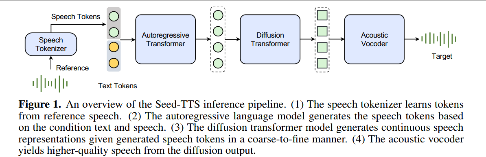

# 2024-Seed-TTS: A Family of High-Quality Versatile Speech Generation Models

***

**简称：** **Seed-TTS**

**作者：** Philip Anastassiou; Jiawei Chen; Jitong Chen; Yuanzhe Chen; Zhuo Chen; Ziyi Chen; Jian Cong; Lelai Deng; Chuang Ding; Lu Gao; Mingqing Gong; Peisong Huang; Qingqing Huang; Zhiying Huang; Yuanyuan Huo; Dongya Jia; Chumin Li; Feiya Li; Hui Li; Jiaxin Li; Xiaoyang Li; Xingxing Li; Lin Liu; Shouda Liu; Sichao Liu; Xudong Liu; Yuchen Liu; Zhengxi Liu; Lu Lu; Junjie Pan; Xin Wang; Yuping Wang; Yuxuan Wang; Zhen Wei; Jian Wu; Chao Yao; Yifeng Yang; Yuanhao Yi; Junteng Zhang; Qidi Zhang; Shuo Zhang; Wenjie Zhang; Yang Zhang; Zilin Zhao; Dejian Zhong; Xiaobin Zhuang

**来源：** arXiv

**DOI：** [10.48550/arXiv.2406.02430](https://doi.org/10.48550/arXiv.2406.02430)

**发表时间：** 2024-06-04

**本地链接：** [2024 - Seed-TTS A Family of High-Quality Versatile Speech Generation Models.pdf](zotero://open-pdf/0_85NXK2XM)

**摘要：** 
介绍了一系列自回归TTS大模型，可以生成与真人无异的语音。SeedTTS作为语音生成的基座模型，语音上下文学习能力出色，在音色相似度、自然度的主观和客观评价指标上，都达到了真人水平。通过微调，可以得到超出GT的主观得分。SeedTTS允许对多种语音属性的控制，比如情感等。同时可以为任意speaker生成高表现力、多样性的语音。

同时还提出了一种自蒸馏方法以进行语音解耦，以及强化学习以提升模型鲁棒性、音色相似度和可控性。

还提出了SeedTTS的NAR变种，使用基于扩散模型的结构。不同于以往的NARTTS系统，SeedTTS-DiT不依赖音素级时长。并证明了SeedTTS-DiT可以达到与基于语言模型的变体（是否就是指SeedTTS）相当的性能，并展现了其进行语音编辑的能力。

**评价：**  代码模型都不会开源。但是demo界面的效果非常棒

## 1.  💡贡献：

#字节 #SOTA #LLM

1.  介绍了SeedTTS，在多项测试中都取得了SOTA表现。其基于zero-shot in-context learning, 可以根据promt生成稳定的、相似的、丰富的语音，几乎与真人语音无法分辨。%%  %%
2.  提出一种自蒸馏音色解耦方法，在声音转换任务上达到SOTA水平。
3.  提出基于强化学习的后训练策略，从整体上提高了模型性能
4.  提出SeedTTS-DiT，全diffusion-based。

## 2.  🌏背景：

本文将TTS模型分为Language model based 和diffusion based.

## 3.  🧩模型：

本文提出了SeedTTS系列，可以达到真人水平的自然度和情感丰富度。SeedTTS的主要目标是实现zero-shot TTS，并在三个方面进行了测试：in-context learning，speaker fine-tuning, emotion control。

本文还提出了两种扩展技术：

1.  基于自蒸馏的语音解耦；不同于以前的特征工程、损失设计或模型设计，本文不需要修改网络结构或损失函数，仅使用简单的自蒸馏技术即达到了高质量的音色解耦
2.  基于强化学习的preference biasing

作者强调，使用了比以往TTS数据搞了量级的数据进行训练，以增强模型的泛化性能和涌现能力。使得SeedTTS在两个方面显著超越了以往模型：

1.  多场景能力，在以往TTS系统失效的呐喊、哭泣等高情感表现力的场景取得了突破性进展。
2.  解决了LM-Based TTS系统共有的稳定性问题。这一能力来源于token、模型的设计，训练、推理策略的改进，数据增广，强化学习。

## 4.  🔬实验：

1.  In-Context learning

    1.  测试数据

        1.  主观测试数据集：中英文各100，内部数据集，高情感表现力、不同口音、方言、情感和风格
        2.  客观测试数据集：1000 from CommonVoice, 2000 from DiDiSpeech
        3.  每个测试集里，每个说话人都包含一条参考音频和一条目标音频，从而可以直接将合成语音与GT进行比较。参考音频时长在3\~20s。

    2.  评价指标：与MaskGCT相同，引文MaskGCT借鉴了这里的配置

        1.  WER：Whisper-large-v3 for english, Paraformer-zh for chinese，
        2.  SIM：WavLM-large fine-tuned speaker verification
        3.  CMOS

    3.  WER与GT接近，SIM超过了GT（因为GT不同句子可能存在风格和背景的不同导致的不够相似）

    4.  作者指出，WER低与相似度并没有直接关系。WER低更倾向于说明模型生成了更标准化的语音从而容易被ASR识别，但是损失了其他需要的特性。比如，当promt有口音或情绪丰富的时候，生成低WER的语音往往口音变轻，模型的输出空间变化有限，反而导致不够自然、相似度也变低。

    5.  在主观测试集上，SeedTTS的CMOS达到了-0.07，而之前的TTS系统都低于-1。SeedTTS是第一个能够在zero-shot in-context learning 上实现任意发音人合成结果与真人相当的系统。

    6.  作者分析较低的CMOS样例，发现合成的语音保持了和promt抑制的韵律，而真人语音往往更加丰富多变。**作者认为multi-shot ICL可能会缓解这一问题，留待后续工作。**

    7.  与传统FastSpeech2 fintune方式进行比较：

        1.  抽取了7个常规发音人和3个特色发音人
        2.  每个发音人使用5h数据fine-tune fastspeech，随积抽取15s作为SeedTTS的promt，然后执行ABtest
        3.  对于常规发音人，SeedTTS在自然度和表现力上有明显领先。而对于特色发音人，则fine-tune方式显著领先。
        4.  作者猜测，这是因为ICL没能成功的保留口音和独特的说话风格，尤其是15s promt中没有涵盖代表性的风格时。作者认为使用更长的promt、更大的训练集可以缓解这一问题。

    8.  在生成数据上训练ASR模型

        1.  使用LibriSpeech 960H训练集，针对每个句子，将其作为promt，然后随机选取一个文本进行合成，得到新的数据集。
        2.  使用WeNet toolkit训练ASR模型， 12层Squeezeformer+3层双向Trtansformer。
        3.  在原始数据上也训练相同的模型，比较两个模型的效果发现，在clean set上，两个模型表现相当，但在other set上，精度损失较多。
        4.  作者猜测，SeedTTS合成时会抑制promt中的噪声，从而导致在带噪数据上泛化性能不佳。
        5.  这证明了使用合成数据训练speech understanding models的潜力，进一步推动speech understanding 和generation的统一。

    9.  在VoxCeleb1数据集上生成音频，与GT音频一起计算音色embedding，并通过t-SNE可视化，发现生成的语音与GT语音分布高度重合。证明了生成语音的音色相似度。

2.  Speaker fine-tuning:实际上是选择几个说话人一起fine-tuning，并不是像小模型一样单独训练

    1.  SFT 模型在客观评价指标WER和SIM上比ICL略有改善，在CMOS主观评价上有显著提升

    2.  说明SFT更有助于学习目标说话人的神韵，比如细微的韵律变化和句末的独特发音模式等。

    3.  这里跟前面与FastSpeech比较的结论是相吻合的，问题都在于较短的promt不一定能够表征说话人全部的发音特点。

    4.  Instruction fine-tuning: #todo LLM时代各种术语的定义

        1.  用来进行解耦化的可控合成
        2.  即使没有显示的输入信号，SFT模型也可以表现出一定的情感，作者认为这是模型学习到了文本和硬干的映射关系。
        3.  加入IFT之后的情感可控度相较SFT大幅提升

3.  低时延推理和流式处理

    1.  对于聊天式应用而言，延迟和首包时延对用户体验至关重要；计算资源和内存资源的占用对于服务部署来说直观重要

    2.  相比于传统的TTS系统，SeedTTS模型尺寸大的多，为部署带来了更大的挑战。因此本文使用了以下三个策略辅助部署：

        1.  因果扩散架构，允许扩散模块流式处理，从而大幅降低延迟和首包时延。
        2.  一致性蒸馏和优化的流匹配算法（Esser et al. \[2024]），降低扩散模型的计算消耗
        3.  降低Language model的内存和计算消耗，包括grouped-query attention、paged attention、flash attention以及模型量化。
        4.  经过上述优化后的流式模型比原始模型显著降低了延迟，大幅提升了RTF，而WER、SIM没有下降，仅CMOS降低了0.02，属于可忽视误差。
        5.  但是作者没有明确实际时延和RTF究竟是多少，而是以原始模型为1进行比较。

4.  模型扩展

    1.  自蒸馏语音分解：将语音分解为独立、解耦的属性 --》 Voice Conversion    

        1.  基于SeedTTS针对同一文本合成不同音色的语音对，语音对具有相同的内容、相似的韵律，不同的音色“The core principle of this method is the creation of controlled speech pairs that share most information yet differ in one or a few specific target attributes.” (\[Anastassiou 等, 2024, p. 8]\(zotero://select/library/items/6PV5EBMN)) (\[pdf]\(zotero://open-pdf/library/items/85NXK2XM?page=8))    

        2.    使用生成的语音对重新训练SeedTTS，其接受A的token输入，B的音色输入，然后生成B的token。从而使网络学会音色解耦

        3.  自蒸馏技术显著提高了SeedTTS在VC任务上的音色相似度

    2.   Preference biasing through reinforcement learning

        1.   即相较于传统的直接给定损失函数，或绝对的损失判定，改为由专家给出自己的偏好
        2.  但是论文里基于WER、SIM、SERmodel 的方法都应该看作是传统的训练方式，而跟偏好强化学习无关啊？
        3.  效果上，取决于不同偏好，基于WERSIM指导的模型，进一步提升了相似度和发音准确率，基于SER指导的模型，提升了情感表现力，但是还是赶不上SFT

    3.  全扩散模型生成(NAR)

        1.  移除了扩散模型对声学tokenizer的依赖，从而扩散模型基于输入文本直接从高斯噪声中生成声码器的隐藏特征

            1.  即，原本使用AR模块输入粗颗粒度的speech token，再由diffusion生成细颗粒度的speech token；现在直接由diffusion生成细颗粒度speech token

        2.  先预测整句时长而不使用音素级时长预测

        3.  还使用指定时长的训练方式，从而可以使用与音频内容编辑、语速调整等场景

        4.  NAR模型天然具有语音内容编辑的功能；同时AR模型天然适用流式处理，便于与基于文本的语言模型集成

        5.  DiT结构比ICL结构具有更高的相似度和相近的WER

        6.  作者测试了不同mask比例下语音生成的WER和SIM，整体比较鲁棒；还测试了不同语速下的WER和SIM，整体也比较鲁棒

## 5.  📜结论：

Seed-TTS 模型系列能够创建极具表现力的跨语言传输语音，支持跨多个应用程序（包括语音聊天、有声读物和内容创建）的升级。此外，凭借其高保真上下文学习，Seed-TTS 增强了跨越语言障碍的可访问性，并为有语言障碍的患者提供了潜在的解决方案 \[OpenAI， 2024]。如 §3.1 中所述，Seed-TTS 还可以作为增强和统一语音理解和生成模型的潜在桥梁。我们将在此页面上演示一些潜在的应用程序。

为了防止技术滥用，作者采用了如下策略：

1.  多层级spoken content 和speaker timbre验证，确保只有授权用户可以使用
2.  多层级水印，加在音频背景或内容介绍中

## 6.  🚩不足：

1.  尽管模型已经展现了一定的涌现能力，但是在细致入微的情感和上下文理解上仍存在一些局限
2.  尽管已经使用了大量数据进行训练，数据覆盖的场景仍有待增加
3.  目前SeedTTS在歌声合成上仍表现不佳
4.  当背景中包含音乐或明显的噪声时，SeedTTS通常难以生成背景一致的声音，如生成的语音中不包好背景音乐或噪声

## 7.  ❓问题：
