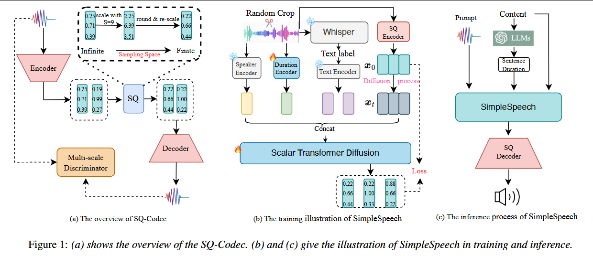

# 2024-SimpleSpeech: Towards Simple and Efficient Text-to-Speech with Scalar Latent Transformer Diffusion Models

***

**简称：** **SimpleSpeech**

**作者：** Dongchao Yang; Dingdong Wang; Haohan Guo; Xueyuan Chen; Xixin Wu; Helen Meng

**来源：** arXiv

**DOI：** [10.48550/arXiv.2406.02328](https://doi.org/10.48550/arXiv.2406.02328)

**发表时间：** 2024-06-14

**本地链接：** [2024 - SimpleSpeech Towards Simple and Efficient Text-to-Speech with Scalar Latent Transformer Diffusion M - Yang 等.pdf](zotero://open-pdf/0_D8JGZ22H)

**摘要：** *在这项研究中，我们提出了一个简单而有效的基于扩散的非自回归(NAR)文语转换系统SimpleSpeech。它的简单性体现在三个方面：(1)它可以在只有语音的数据集上训练，没有任何对齐信息；(2)它直接以纯文本作为输入，通过NAR的方式生成语音；(3)它试图在有限而紧凑的潜在空间中对语音进行建模，从而减轻了扩散建模的难度。更具体地说，我们提出了一种新的标量量化语音编解码模型(SQ-Codec)，SQ-Codec有效地将复杂的语音信号映射到一个有限而紧凑的潜在空间，称为标量潜在空间。得益于SQ-Codec，我们在SQ-Codec的标量潜在空间中应用了一种新的变压器扩散模型。我们在4k小时的纯语音数据集上对SimpleSpeech进行了训练，它显示了自然的韵律和语音克隆能力。与以往的大规模TTS模型相比，该模型在语音质量和生成速度上都有明显的提高。发布了演示文稿。*

**评价：** SQ-Codec还行，其他方面并无太多可取之处

***

## 💡贡献：

 #港中文 #蒙美玲 #代码开源 #LLM #SOTA

1.  证明了大规模无标注语音数据可以用来构建NAR TTS系统
2.  提出一个标量隐藏transformer扩散模型，将语音信号映射到有限、紧凑的隐藏空间。本文提出了基于scalar quantization的SQ-Codec。
3.  提出使用句级时长替代音素级时长。句级时长在训练和推理时都可以方便得到，且句级时长可以带来更多多样性。
4.  实验证明了SimpleSpeech的有效性

## 🌏背景：

传统TTS系统在小范围、高质量、有标注语音数据上进行训练，pipeline相对比较复杂，比如G2P、prosody prediction、phoneme duration prediction等。近来基于大规模语音数据，涌现了很多简化的方法。

Vall-E 使用预训练 Encodec将语音信号映射到离散token上，然后使用自回归语言模型将音素序列转换成语音token。其为AR模型，推理慢且不稳定。之后NaturalSpeech2、SoundStorm、VoiceBox等非自回归方法被提出，具有更快的推理速度和更好的稳定性，但是都依赖音素-声学特征的对齐信息，并且训练流程比较复杂。

本文提出了一个简易有效的TTS系统，以非自回归的方式，不依赖任何对齐信息生成高质量的语音。面临的主要困难包括：

1.  如何利用大规模无标注的语音数据
2.  如何设计可以生成高质量语音的NAR模型结构
3.  如何在不使用时长模型的前提下解决时长对齐问题

🧩模型：

*   Text Encoder

    1.  使用Whisper ASRmodel获取转录文本
    2.  为了利用LLM以简化传统TTS前端，本文使用预训练的LLM作为Text Encoder来提取文本表征

*   Speaker Encoder

    1.  使用XLSR-53的第一层输出的全局embedding作为音色表征

*   Sentence duration

    1.  使用gpt-3.5-turbo进行in-context learning，输入几个示例句子和对应时长，要求gpt回答新输入句子可能的时长。
    2.  获取全句时长之后，模型可以隐式的学习单词和隐藏特征之间的对齐关系。
    3.  参考Stable Audio，使用timing module将时长编码为全局embedding。

*   SQ-Codec

    1.  作者认为RVQ-based codec需要大量tricks和复杂的损失设计才能完成训练

    2.  本文提出使用SQ替代RVQ，仅需要重建损失和对抗损失就可以完成训练，且该方法可以将复杂的语音信号压缩到有限、紧凑的隐藏空间，非常适配扩散模型。

    3.  具体方法：$h=\text{torch.tanh}(h), s = \text{torch.round}(h*S)/S$，其中S为确定标量空间范围的超参，范围为2S+1

    4.  梯度回传使用straight-through estimator，即将梯度直接全等赋值

    5.  作者指出，以前也有工作使用SQ应用于图像生成领域，但作者强调本文的实现与前作不同，且更适配与语音codec任务

    6.  encoder 使用5层卷积块，每层包括两个因果1维卷积和一个下采样层，下采样率分别维2，2，4，4，5。Decoder镜像。

    7.  重建损失包括时域L1和频域MSE；对抗损失使用多尺度判别器

*   Scalar Latent Transformer Diffusion Models

    1.  GPT2-like transformer backbone：12 attention layer， 8 heads， 768 dims
    2.  将时间步t和条件c作为prefix sequence和input sequence一起输入，这种方式就叫做in-context learning
    3.  LDM可以用来建模VAE隐藏特征、Mel谱特征甚至音频信号，本文认为这些建模对象处于无限空间，建模难度较大。而本文提取的SQ-Codec提供了一个有限且紧凑的标量空间，建模难度更低。

## 🔬实验：

1.  训练数据：4kh 英文数据，抽取自Multilingual LibriSpeech

2.  测试数据：LibriTTS test clean

3.  SQ-Codec的训练使用LibriTTS数据集；Diffusion的训练使用上述4k h英文数据

4.  对比模型：

    1.  For codec: Encodec、DAC、HiFi-Codec
    2.  For TTS model: VALL-EX、PhemeTTS、X-TTS、E3TTS、NaturalSpeech2

5.  评价指标：

    1.  For codec: PESQ、STOI、SSIM
    2.  For TTS：WER、SIM、DNSMOS、MCD

## 📜结论：

1.  SQ-Codec：

    1.  在参数量更小的情况下，三个量化指标均优于现有的codec模型
    2.  作者发现在S设置为1的时候，效果很差，随着S的增加，效果也逐渐提升

2.  Zero-Shot TTS

    1.  作者认为之前的TTS大模型合成质量都不好，而SimpleSpeech凭借优秀的Codec吊打他们
    2.  推理速度上，SimpleSpeech是NAR结构，优于AR结构；相较于NAR模型，SimpleSpeech只需要解码100步即可，而E3TTS和NaturalSpeech2分别需要1000步和150步。

3.  TextEncoder：

    1.  将ByT5更换为BERT，模型WER显著增加，作者认为可能是因为BERT使用word peice作为token 丢失了word的信息。

4.  Model turcture

    1.  将transformer 替换为Unet，效果也有明显下降

5.  Latent Space

    1.  SQ效果优于VAE，而训练DAC失败。作者认为可能是因为DAC的维度太多，不利于生成模型学习。

6.  Condition style

    1.  将InContext learning 替换为cross attention，同样带来效果下降

7.  数据量：数据量越大效果越好

## 🚩不足：

## ❓问题：

1.  依赖了过多的外部预训练模块，推理时需要依赖TextEncoder(ByT5)、Speaker Encoder(XLSR-53)和LLM(gpt-3.5-turbo)，会给部署带来较大的挑战。而且文中比较推理速度时，不知有没有统计这些模块的耗时。
2.  但总的来说，最起码SQ的思想是好的。
