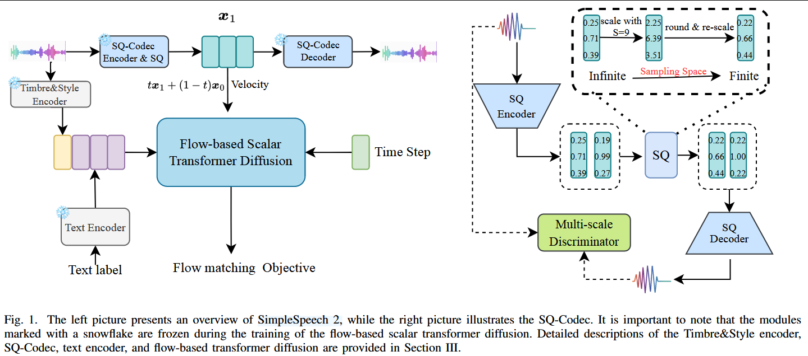

# 2024-SimpleSpeech 2: Towards Simple and Efficient Text-to-Speech with Flow-based Scalar Latent Transformer Diffusion Models

***

**简称：** **SimpleSpeech 2**

**作者：** Dongchao Yang; Rongjie Huang; Yuanyuan Wang; Haohan Guo; Dading Chong; Songxiang Liu; Xixin Wu; Helen Meng

**来源：** arXiv

**DOI：** [10.48550/arXiv.2408.13893](https://doi.org/10.48550/arXiv.2408.13893)

**发表时间：** 2024-08-28

**本地链接：** [2024 - SimpleSpeech 2 Towards Simple and Efficient Text-to-Speech with Flow-based Scalar Latent Transforme - Yang 等.pdf](zotero://open-pdf/0_3UN5G7L3)

**摘要：***将文本到语音转换(TTS)扩展到大规模数据集已被证明是提高合成语音的多样性和自然度的有效方法。在高层，以前的大规模TTS模型可以被分类为基于自回归(AR)的模型(例如，VALL-E)或基于非自回归(NAR)的模型(例如，NaturalSpeech 2/3)。虽然这些作品表现良好，但仍有潜在的弱点。例如，基于AR的模型存在生成质量不稳定、生成速度慢的问题；同时，一些基于NAR的模型需要音素级别的时长对齐信息，从而增加了数据预处理、模型设计和损失设计的复杂性。在这项工作中，我们通过实现一个简单而高效的非自回归(NAR)TTS框架SimpleSpeech 2来建立我们的基础。SimpleSpeech 2有效地结合了自回归(AR)和非自回归(NAR)方法的优点，提供了以下关键优势：(1)简化的数据准备；(2)直接的模型和损失设计；(3)稳定、高质量的生成性能和快速的推理速度。与之前发表的文章相比，我们提出了(I)详细分析语音标记器和噪声标签对TTS性能的影响；(Ii)四种不同类型的句子时长预测；(Iii)一种新的基于流的标量潜伏变压器扩散模型。通过这些改进，与我们之前的工作和其他最先进的(SOTA)大型TTS模型相比，我们在生成性能和生成速度方面都有了显著的改进。此外，我们还证明了SimpleSpeech 2可以通过在多语言语音数据集上进行训练来无缝地扩展到多语言TTS。有关演示，请访问：https\://dongchaoyang.top/SimpleSpeech2 Demo/。*

**评价：**这篇文章更多的像是完整版的SimpleSpeech，包括了SimpleSpeech的所有核心内容；而且这里支持中文了。

***

## 💡贡献：

\#蒙美玲 #港中文 #LLM

1.  提出了SimpleSpeech2， 一种简单高效的NAR TTS系统

2.  实验分析了不同speech tokenizer对TTS系统的影响，并分析了tokenizer 完备性和紧凑性对TTS系统的影响

3.  研究了句级时长预测器对TTS的影响，并提出了四种结构

4.  提出一种<a href="zotero://open/library/items/3UN5G7L3?page=2">“flow-based scalar transformer diffusion model”</a>，比DDPM-based diffusion更快更稳定。并从LLM中引入了<a href="zotero://open/library/items/3UN5G7L3?page=2">“time mixture-of-experts”</a> transformer backbone.

本文在SimpleSpeech基础上丰富了更多的内容。

## 🌏背景：

1.  随着深度学习技术的发展，TTS已经可以合成自然度、可懂度于真人相媲美的语音。但由于其依赖小批量、高质量、有标签的数据训练，其仅能合成指定音色、风格和语言。

2.  从建模方式可以分为自回归和非自回归两种。一般而言，非自回归模型在生成速度和稳定性上优于自回归模型，但隐式时长建模和自回归采样策略使得自回归模型具有更好的多样性、灵活性、韵律丰富度、情感表现力。

3.  NAR模型依赖细粒度对齐信息，使得数据预处理变得复杂起来。大量工作使用MAS来学习对齐信息，但这不仅增加了训练复杂度，还可能导致对齐不合适。更严重的是，音素和语音表征的刚性对齐会导致不自然的韵律。

4.  近来，涌现出一系列工作基于大规模数据训练TTS模型。基于语言模型的TTS模型简化了数据处理流程，其网络结构、训练策略都继承于NLP领域的LLM。但是最终他们都没有解决AR和NAR的问题。因此，作者提出第一个关键问题：<a href="zotero://open/library/items/3UN5G7L3?page=2"><strong>“whether we can develop a simple, efficient, and stable TTS system capable of synthesizing diverse, natural, and controllable speech.”</strong></a>

5.  由于语音信号的长序列特征和复杂性，大部分large TTS model都会使用speech tokenizer来提取中间表征，比如codec模型输出的离散token或VAE输出的连续embedding。然后再使用生成模型对器进行建模。但是作者发现这些工作大都聚焦于如何提升TTS系统的表现，而忽视了speech tokenizer的影响。因此作者提出第二个关键问题：<a href="zotero://open/library/items/3UN5G7L3?page=2"><strong>“what is a good speech tokenizer for large TTS models”</strong></a>。speech tokenizer的对比包括两个方面：完备性，即可以恢复语音信号；紧凑性，即编码参数或映射空间应尽可能小。作者从实验角度对比了常用的speech tokenizer。

6.  大规模数据通常来源于ASR数据集，历史工作都没有提及如何获取对应转录抄本。本文使用Whisper进行转写，但显然识别结果可能存在错误从而导致标签噪声。因此作者提出第三个问题：<a href="zotero://open/library/items/3UN5G7L3?page=2"><strong>“Can a dataset comprising noisy labels effectively train a high-quality TTS system?”</strong></a>作者从理论上分析了大规模数据中包含少量带噪标签，等价于**classifier-free guidance training** #todo

7.  相关工作

    1.  Speech Tokenizer

        1.  Speech tokenizer 整体可以分为两类，Codec和VAE。其中Codec的目标是将音频量化为离散token，VAE旨在建模音频的均值方差分布。
        2.  尽管Codec已经广泛应用了，但仍面临codebook collapse和复杂训练损失构建问题。RVQ方法将一帧音频量化为多个token，虽然可以减小重建损失，但是加大了生成模型的学习难度。
        3.  VAE也面临类似的问题，需要统筹方差的等级于重建表现的平衡问题。同时，其连续向量的本质也使得生成模型难以学习。因此，现在VAE方法都使用KL损失迫使学习到的隐藏特征趋近于标准正态分布。

    2.  Large scale TTS

        1.  LLM-based AR model without phoneme duration：AudioLM， VALL-E, SpearTTS, VoiceCraft, UniAudio

            1.  使用codec将语音映射到token，将TTS任务重构为AR语言建模任务
            2.  生成速度慢，不稳定

        2.  LLM-based AR model with phoneme duration：VALLE-R, RALL-E

            1.  训练阶段引入音素时长

        3.  NAR genetative model with phoneme duration:

            1.  NaturalSpeech2/3：对音素级时长的依赖导致难以利用大量的wild data，同时硬边界会导致韵律的不自然
            2.  Voicebox, Audiobox （From FAIR，超长论文）基于流匹配的预训练-微调策略
            3.  HierSpeech++ 使用级联推理方法

        4.  NAR model without phoneme duration

            1.  E3TTS 使用扩散模型根据文本生成固定长度的语音。从而训练阶段不依赖对齐信息。但是固定长度生成限制了模型的灵活性
            2.  SeedTTS
            3.  DiTTo-TTS
            4.  E2TTS

    3.  扩散模型

        1.  扩散模型的效果已经得到了证实，但是目前的方法大都依赖额外的时长预测。

## 🧩模型：

1.  Text Encoder

    1.  使用Whisper从音频中获取转录抄本
    2.  使用ByT5从文本中提取embedding，而不使用音素信息【这里也只使用了英文数据集】

2.  基于语音属性解耦的Speaker Encoder

    1.  前置工作直接从codec中提取speaker promt，但是这里会冗余其他信息，从而可能对最终合成效果带来不利影响。例如若promt中含有噪声，则生成的音频往往也会包含噪声。
    2.  本文使用预训练的FACodec提取音色表征。首先通过FACodec的timbre encoder获取全局embedding；然后将promt分成三段，分别提取style embedding，从而体现韵律随时间的变化趋势；最后将两个embedding拼接到一起。

3.  SQ-Codec

    1.  现在比较流行的RVQ存在以下缺点：

        1.  训练复杂，需要大量tricks和复杂的损失设计
        2.  重构表现于codebook的数量正相关，但过大的codebook会增加LM-based 生成模型的负担
        3.  连续表征的分布复杂且是无限的，也会增加生成模型的学习难度

    2.  所以这里使用SimpleSpeech提出的SQ-Codec，包括encoder、scalar quantization、decoder

    3.  作者还指出，有工作在image tokenizer中使用了SQ方法，但是本文的实现方式和目的均与他们不同。

        1.  但是看了以下之前的论文，实现方式基本一致

4.  Flow-based Diffusion Models

    1.  以前的额TTS大都直接在连续空间进行建模。本文提出在紧凑、完备、有限的空间进行建模更加简单，也更适配于扩散模型。

    2.  采用flow-based diffusion model，也成为flow-matching。flow matching通过在噪声和数据之间线性插值也得到有损数据。不同时间步的比例可以为0-1均匀分布的线性策略，也可以是使用三角函数的余弦策略。本文使用线性策略。然后基于ODE求解概率流。

    3.  模型结构:LLAMA-style transformer

        1.  RoPE

        2.  RMSNorm：替换所有的LN以增加训练稳定性。在key-query 点乘之前先进行norm，可以消除attention 概率中过大的值从而避免损失发散

        3.  条件策略：in-context condition strategy，将条件特征和噪声隐藏token两种模态拼接输入，通过self-attention自行学习彼此关联。

        4.  Time Mixture-Of-Experts

            1.  本文使用流扩散模型逐步求解ODE得到不同时间步上对标量隐藏特征分布的估计

            2.  当时间步趋向于0时，输入x几乎全是噪声，此时模型主要从条件特征（文本、音色）中学习语义信息；当时间步趋向于1时，输入x基本包含了大部分的语义信息，因此模型更多的学习如何优化细节，即提高音质。

            3.  为了加强flow-based 生成模型的能力，作者参考**ERNIE-ViLG 2.0**，将所有时间步均分为四块，构成四个专家系统。

            4.  直观地说，当使用更多的专家时，每个块包含的时间步就会更少，从而使每个专家能够更好地专注于学习分配给它的特定去噪步骤的特征。【怎么这么绕口，是指四个专家中的更多，还是不止四个专家的更多？】

5.  Classifier-Free Guidance

    1.  正常模型建模的都是条件分布$p(x|y)$,  现在额外添加一个无条件分布$p(x)$,即没有输入限制，让模型随机输出。将两者的加权和作为最终建模目标。加权权重$\lambda$为超参，即$\hat{p}(x|y) = (1-\lambda)p(x) + \lambda p(x|y)$

    2.  $\lambda=1$时，无条件分布项消去，为原本的条件分布。$\lambda > 1$时，表示加强对条件分布，并抑制无条件分布。

    3.  训练阶段，通常在训练数据中以10%的比例mask掉条件输入以优化无条件概率分布。

    4.  以前的工作中有实验证明，ASR输出的带噪标签可以用来训练TTS，但没有深入解释为什么。本文发现，训练集中的少量带噪样本，相当于引入CFG训练策略，甚至不需要手动为输入条件添加mask。

6.  Sentence Duration

    1.  相较于v1，取消了时长encoder，现在时长仅用于控制输出长度

    2.  新提出了四种时长预测方法，

        1.  基于ByT5预训练模型，加上预测器输出时长，效果最佳

            1.  由于模型本身就需要使用ByT5的输出，因此实际上没有增加多少计算量

        2.  基于ChatGPT in-context learning输出时长

        3.  使用FastSpeech2的时长预测器输出帧级时长，再进行random scale，加和得到句级时长

        4.  使用自回归的时长预测器输出帧级时长，加和得到句级时长

## 🔬实验：

1.  训练数据：

    1.  EN： Multilingual LibriSpeech中的英文数据7k小时，裁剪到最长10s，16kHz采样率
    2.  Multi Language：在en的基础上添加4k WenetSpeech。

2.  测试数据：

    1.  作者指出，大部分工作都是在LibriLight或MLS上进行训练，在LibriSpeech上进行验证，但LibriSpeech和LibriLight都来自于LibriVox audiobooks, 因此可能不能作为真实的集外测试集。
    2.  组合LibriTTS、VCTK、CommonVoice、RAVDESS构成测试数据集

3.  SQ-Codec 训练

    1.  16kHz，S=9，d=32, Adam, lr2e-3, 200k steps

4.  TTS训练

    1.  Adam, lr1e-4, cosine learning rate scheduler, 1k step warmup, total 400k steps,
    2.  16 transformer layer, hidden size 768, head 32

5.  推理

    1.  文本特征输入时长预测模型，得到句级时长
    2.  文本和音色promt作为prefix输入TTS，得到隐藏特征
    3.  使用SQ-Codec 解码器解码得到音频

6.  基线模型

    1.  TTS：

        1.  VALL-E：复现
        2.  VALL-EX：开源
        3.  VoiceCraft：开源模型
        4.  ARDiT：demo
        5.  ChatTTS：开源
        6.  NaturalSpeech2：复现
        7.  NaturalSpeech3：author 提供
        8.  HierSpeech++：开源
        9.  E3TTS：demo
        10. DiTTo-TTS：demo

    2.  Speech Tokenizer：

        1.  Encodec：开源
        2.  DAC：开源
        3.  HiFiCodec：开源
        4.  SoundStream：开源代码
        5.  VAE：Stable Audio开源代码

7.  评价指标：

    1.  Tokenizer：重构质量，PESQ、STOI、SSIM

    2.  TTS：

        1.  可懂度：一般使用WER，但是SeedTTS指出WER可能并不是确定性标准。因此本文使用Whisper-Large和Hubert-large-based ASR共同评估计算平均WER。

        2.  相似度：

            1.  WavLM-TDNN 和 XLSR第一层输出，没有明确指出，但应该也是两个算均值

        3.  音质：

            1.  DNSMOS， MCD

        4.  合成速度：RTF

        5.  主观指标：MOS、SMOS

## 📜结论：

1.  Tokenizer

    1.  结论与之前一样，SQ-Codec在三个指标上都取得了SOTA效果。

2.  TTS

    1.  音质：由于采用了更先进的speech tokenizer 和generative model，SimpleSpeech的MOS和DNSMOS都超越了其他方法，甚至超越了GT。 -- 这里充分说明了不同论文中对于MOS的评价标准不一致，此处GT甚至没有达到4的MOS
    2.  相似度：相似度略逊于X-TTS，但作者认为，其他工作已经证实，随着数据量增加，相似度会进一步得到改善，而本文中使用的数据约其他方法的十分之一，因此还有很大提升空间。
    3.  稳健性：超过之前的AR模型，但仍不如主流的NAR模型。作者也认为这个可以通过增加数据量来弥补，因为SeedTTS使用了类似的方法，但利用了更多的数据，其稳健性更好。
    4.  生成速度：仅需要25步解码，生成速度元朝其他AR、NAR模型。

3.  Tokenizer 隐藏空间尺度

    1.  Tokenizer的自重建效果代表了后续TTS的上限
    2.  离散token比连续分布更容易被生成模型学到
    3.  特征空间的紧凑性极大的影响生成模型的性能。当维度由原来的32增加到50时，自重建效果提升，但是整体TTS效果反而显著下降。同时，降低维度时，自重建效果下降，也抑制了生成模型的上限。

4.  时长预测：GPT输出不稳定，AR输出不稳定，FS2和基于ByT5直接训练效果差不多。

5.  消融实验验证了Time-MoE的有效性，证明了flow-based diffusion 优于DDPM

6.  CFG系数影响模型效果，本文采用系数5。 -- 比较反直觉，直观上以为这个系数应该是0\~1

7.  中文支持：

    1.  效果与在大规模中文数据库上训练的ChatTTS相当
    2.  但是，在模型鲁棒性上仍有较大的提升空间 -- 还是多音字的问题，作者认为可以加数据解决
    3.  支持code-switched speech。

## 🚩不足：

## ❓问题：

感觉把1留下的坑都填上了。现在整个流程就是Text->ByT5->Sentence duration -> flow-transformer -> SQCodec-decoder ->audio，也比较合理。

现在的问题就是作者提到的，中文多音字问题。如果不使用G2P模块，就必然会面临这个问题，而一旦使用G2P模块，就不能使用ByT5预训练的Text Tokenizer。
