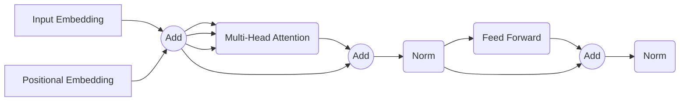

## 1.  起源
[Attention Is All You Need](https://arxiv.org/abs/1706.03762) @ Google
引入了self-attention (Q, K, V 来源于同一个输入)和cross-attention（Q, 和K,V来自不同的输入）。
引入了positional embedding。
Encoder流程：

Decoder流程：
encoder的self attention block 和 Feed Forward block 之间添加一个cross attention block。
## 2.  优化
- LLaMA-2：
	- 
	- RMS Norm
	- RoPE
	- MLP
## 3.  Positional Encoding/Embedding
## 4.  Attention
主要用于解决长时依赖问题。
attention权值计算的方法主要是点积（dot product，应用在矩阵上即矩阵乘法）。其计算方式为：
$$Attention(Q, K, V) = Softmax(\frac{QK^T}{\sqrt{d_k}})V$$
即，根据Query和Key的距离，对Value进行加权求和。
### 4.1.  Q1： 为什么使用Softmax
其中Softmax用于保证权重总和为1，为仅选择最相关的一个value的Hardmax的弱化。
### 4.2.  Q2：为什么除以$\sqrt{d_k}$ 
将Q、K看作两个零均值一方差的独立变量，其点积之后的方差将扩大为$d_k$，因此为了限制数据范围，防止Softmax梯度消失，对数据重新进行规整。
另外，谷歌T5中的attention没有除，但是其计算Q、K的权重矩阵在初始化时进行了除以$\sqrt{d_k}$的操作，从而实现了同样的效果。

观察Attention计算方式可知，其计算复杂度为$O(n^2d) + O(n^2) + O(n^2d)$，由于$d$为常数，也可以记作$O(n^2)$。其空间复杂度为$O(n^2 + nd)$，忽略$d$，也可以记作$O(n^2)$。
在大模型时代，严重限制了token长度，因此产生了很多对Attention的优化方式 。
-> 稀疏化/降维
-> 线性化
-> 分块计算：MQA
-> 内存优化：[[Flash Attention]]

## 5.  LLM 三种范式
1. Encoder Only (BERT)
	1. 用于理解输入内容，不使用自回归输出。
	2. 更擅长做分类任务，即感知任务
2. Deocder Only（ChatGPT、LLaMA）
	1. 自回归生成，适用于生成任务
	2. 相当于Encoder Only模型+causal mask
3. Encoder-Decoder （T5）
	1. 输出强烈依赖输入的任务，如翻译和文本总结。
